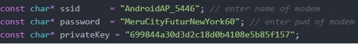
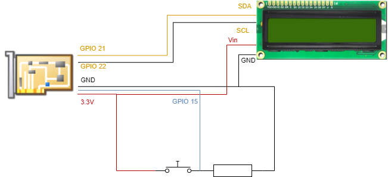

# DemoIoTLowPower

L'objectif de ce projet est d'utiliser les spécificités de l'ESP32 afin de faire de la basse consommation.
Pour se faire nous avons mis en place une machine d'état afin que le module puisse passer en Deep Sleep Mode lorsqu'il n'est pas utilisé.
Le système permet de visualiser la température extérieure via l'écran LCD d'une ville ou de la ville dans lequel est situé le module.

# Installation

Dans l'objectif de récupérer la température actuelle d'une ville, nous utilisons l'API du site [weatherstack](https://weatherstack.com/).
Pour utiliser l'API, il faut récupérer la clé liée à son compte.

2 - Paramétrages à effectuer dans le code.

Afin de faire fonctionner la démo, il faut configurer certaines variables dans le code.
Premièrement pour le Wi-Fi, afin que l'ESP32 se connecte au Wi-Fi, il faut lui indiquer le nom et le mot de passe.
Deuxièmement, il faut placer sa clé personnelle du site weatherstack.com dans la constante "privateKey"

3 - Branchement

Si vous avez une ESP32 vous pouvez suivre le schéma ci-dessous.

# Fonctionnement

Le système va récupérer une première fois les données de l'API durant le démarrage.
Les informations récupérées sont sur la ville de Paris, ceci peut être modifié dans le code avec la constante "city".
Par la suite, chaque minute, le système va mettre à jour ses données, le rythme peut être modifié dans le code avec la constante TIME_TO_SLEEP.
Lorsque les données sont à jour et que le système est en veille, l'appui sur le bouton-poussoir va allumer le module et afficher la dernière température enregistrée sur l'écran.
6 secondes plus tard, le système revient en état de veille.
